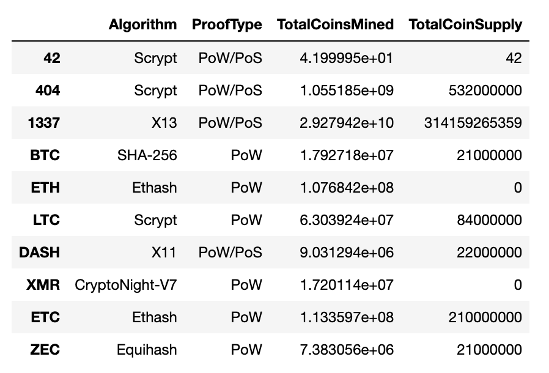
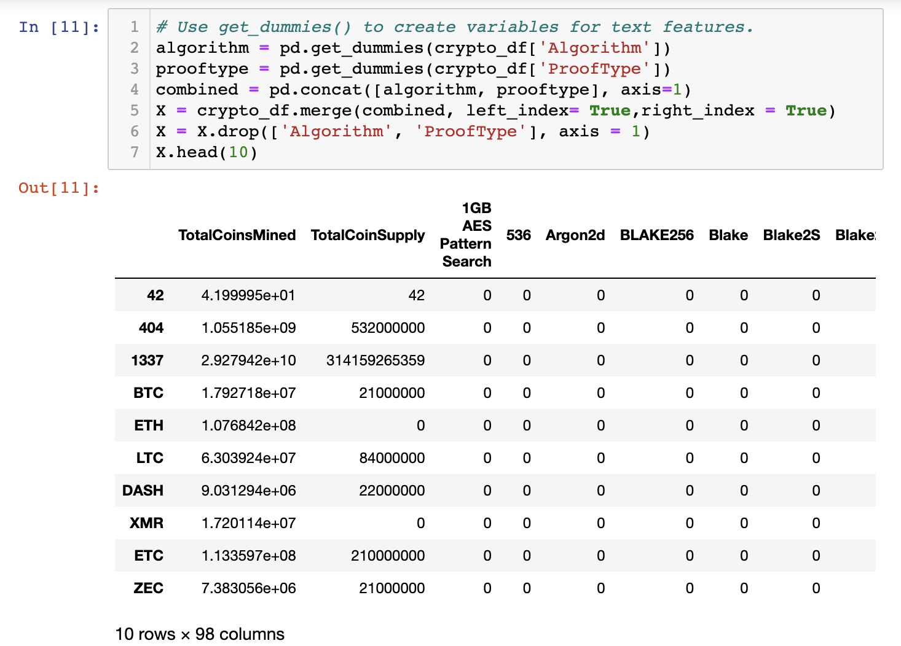
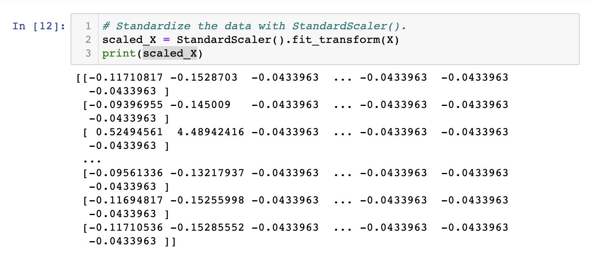
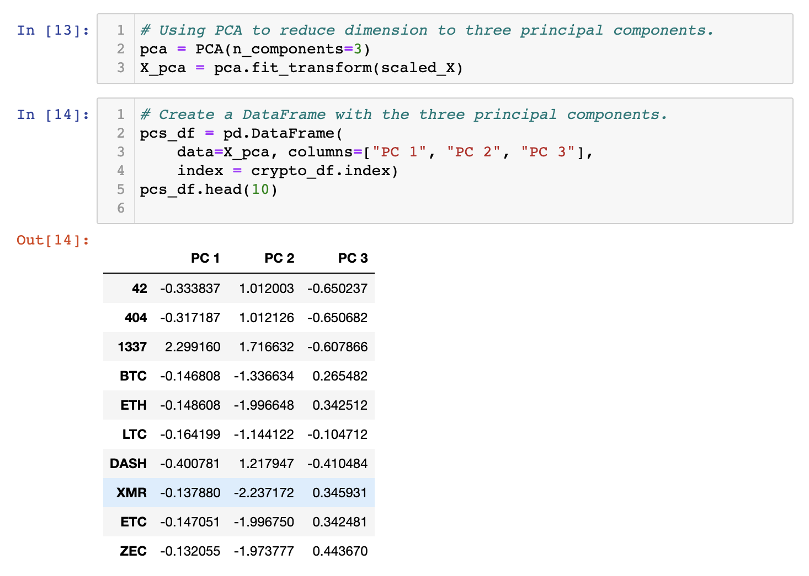
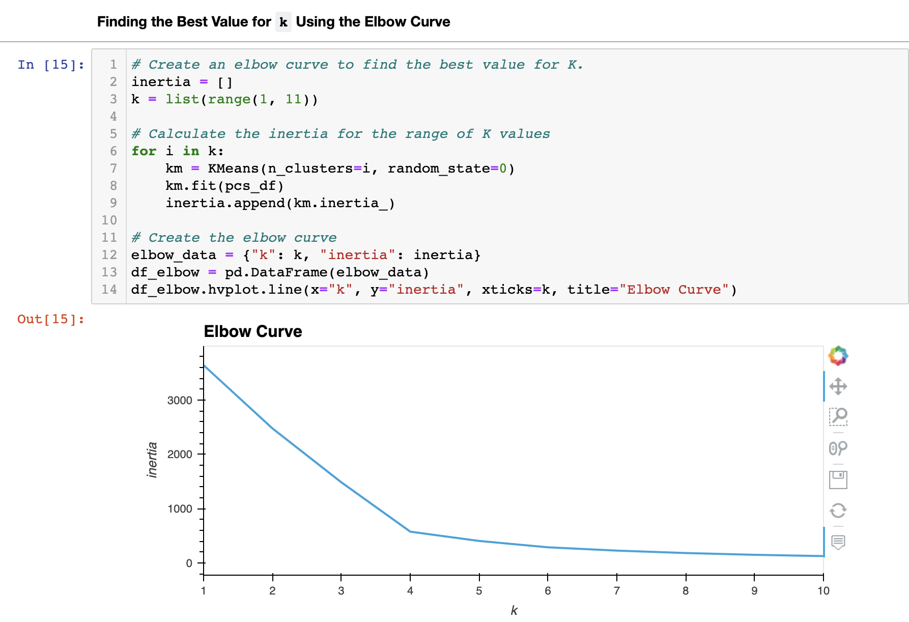
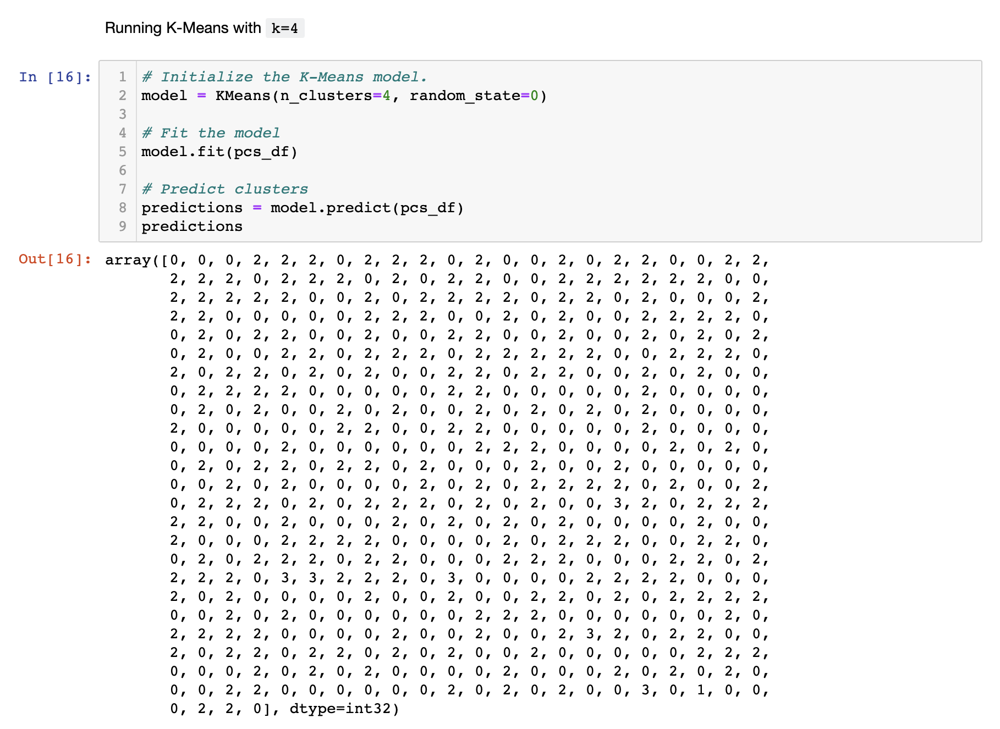
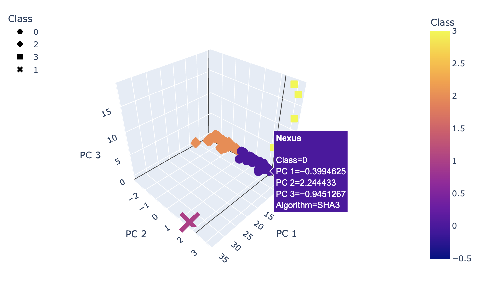
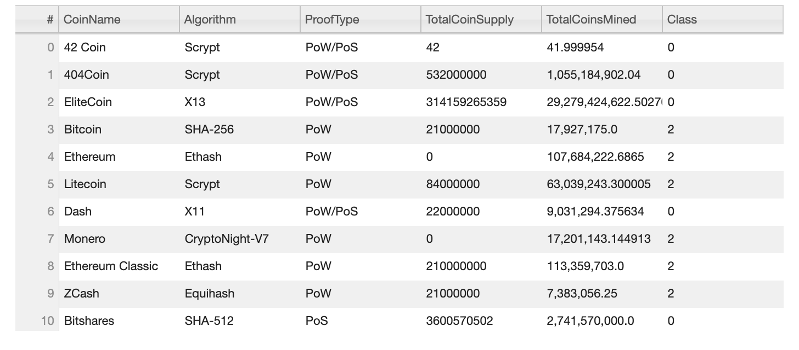
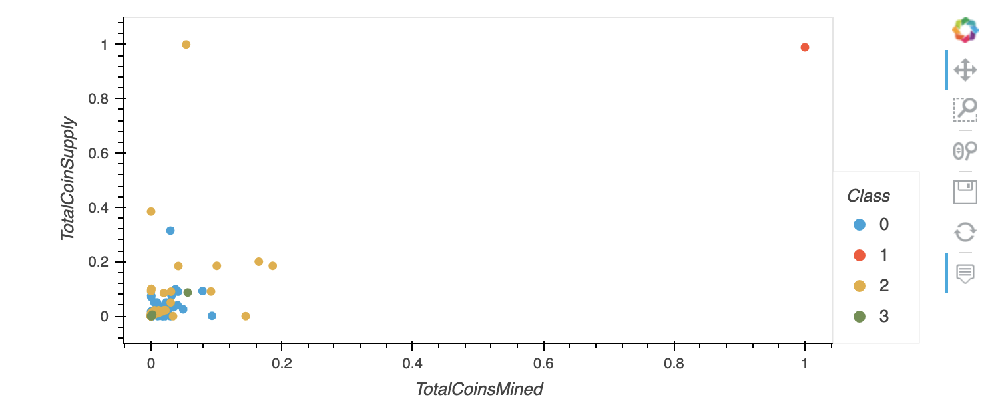

# Cryptocurrencies

## Overview

We were approached by Accountability Accounting, a prominent investment firm studying the prospects of new cryptocurrency investments. The dramatic rise and fall of BitCoin has made the endeavor seem initially  contrived. 

To evaluate the various types of currencies that exist, they requested us to perform an in-depth analysis of the cryptocurrencies that are on the trading market, creating a dataset that will classify and show profitability of each of these cryptocurrencies and display the data as tables and graphs showing tendencies.

## Results

### Data Preprocessing Selection and Transformation

These were our steps:

- Preprocessing the data for PCA

  

  - Using *get_dummies()* function to create variables for text features:

    

  - Standardizing data with *StandardScaler()*:

    

    

- Reducing Data Dimensions Using PCA

  - Creating a DataFrame with three principal components:

    

    

### Clustering Cryptocurrencies Using K-means

First we found the best value for K using the **Elbow Curve** as seen below:

Subsequently, we initialized the **K-Means model** that predicted the clusters:

Finally, we created a new DataFrame that contains the predicted clusters, along with the cryptocurrency features:

### Visualizing and Interpreting Cryptocurrencies Results

We created visualizations of our results.

- **3D-Scatter with Clusters**

  

  

- **Table with tradable cryptocurrencies**

  

  

We are able to predict that there are **532 tradable cryptocurrencies**.

We scaled data using *MinMaxScaler()* to create a **scatterplot with tradable cryptocurrencies**:

